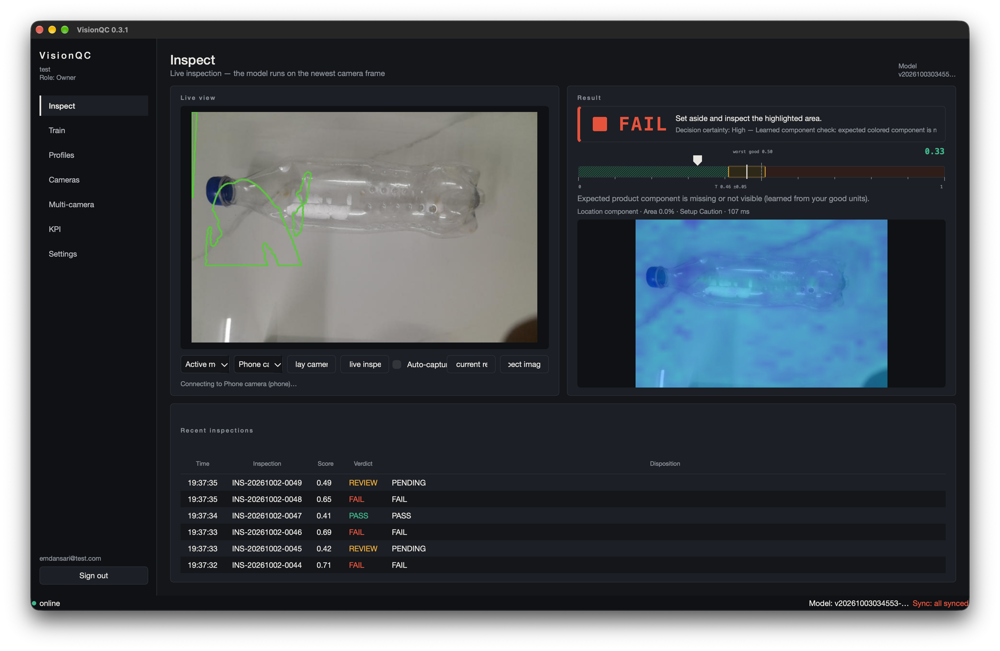
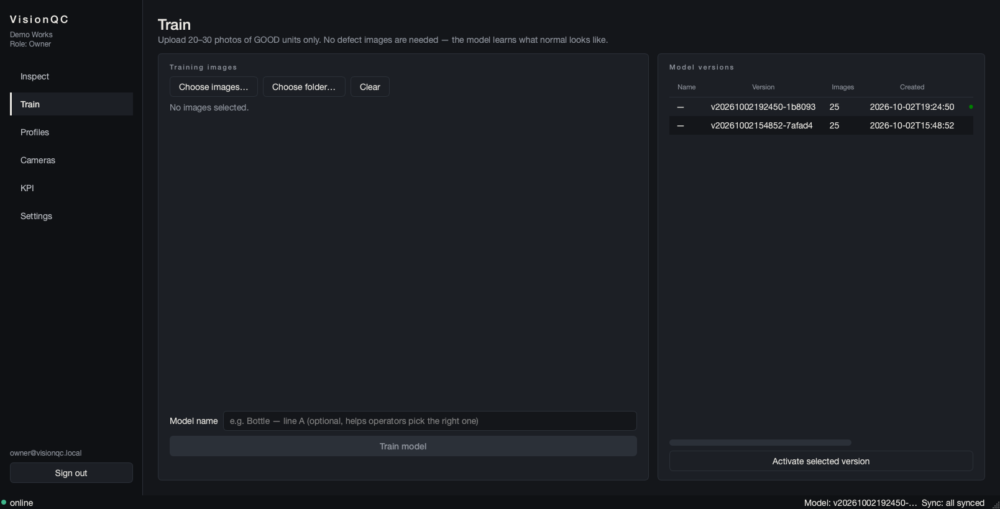
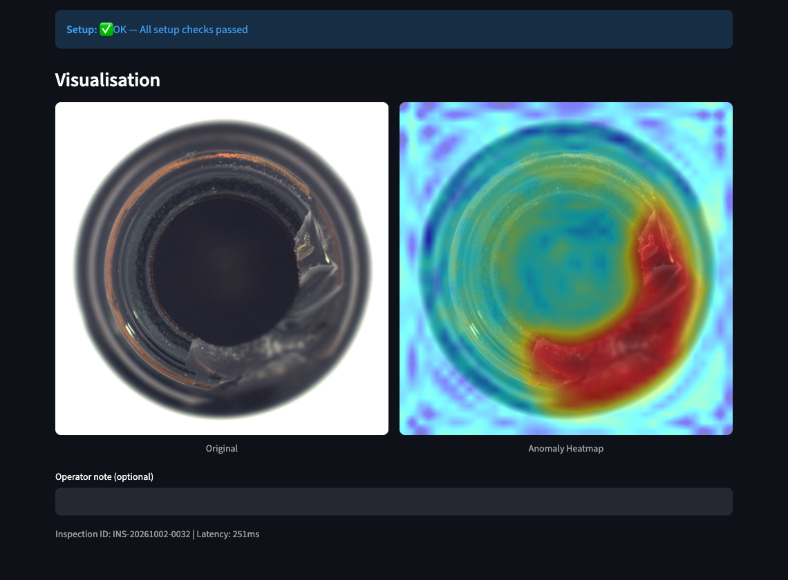
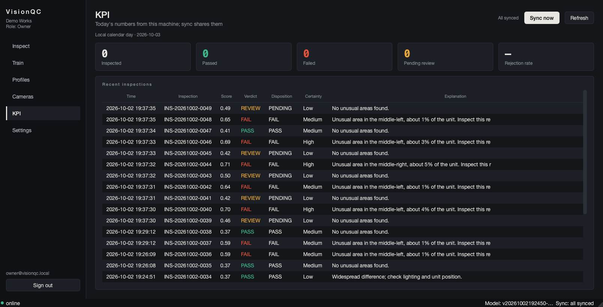
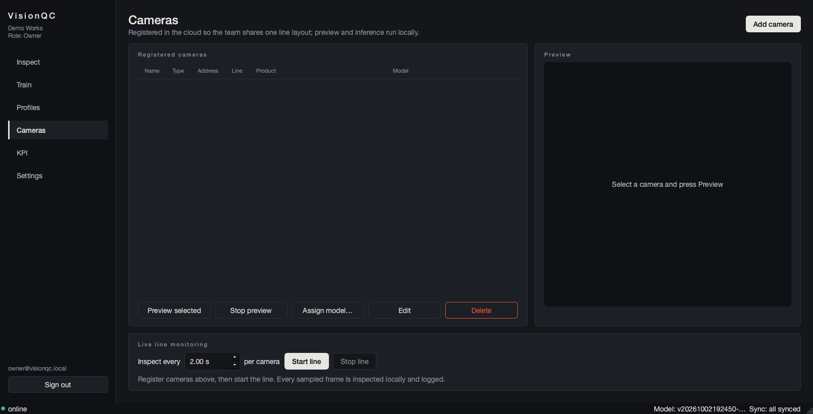
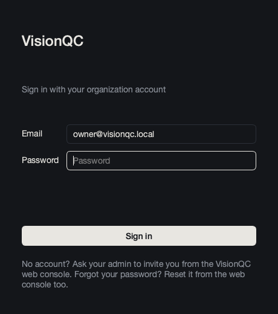
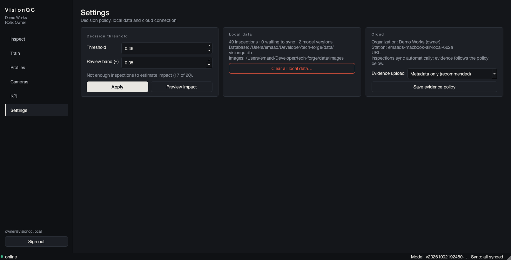
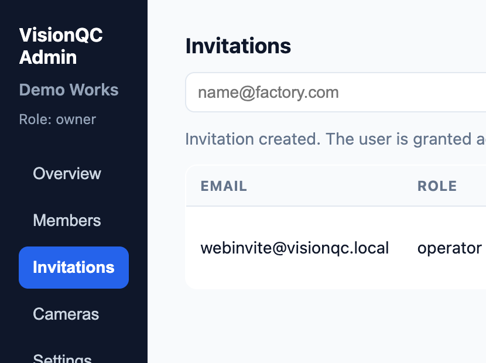

# VisionQC

[](https://github.com/EmaadAkhter/T2-VisionQC/actions/workflows/desktop-build.yml)
[](https://github.com/EmaadAkhter/T2-VisionQC/actions/workflows/backend-tests.yml)

**TECHFORGE 2026 · Team T2 · Domain: AI/ML**

Offline visual inspection assistant for small manufacturers. Learns "normal"
from 20-30 good photos using unsupervised anomaly detection (PatchCore) — no
defect dataset needed.

## Team Details

| Field | Details |
| --- | --- |
| **Team Name** | T2 |
| **Team Leader** | Touheed Shaikh |

## Team Members

| Name | Role |
| --- | --- |
| Touheed Shaikh | Team Leader |
| Mohd Zakir | Team Member |
| Mohd Emaad | Team Member |
| Abdul Ghani | Team Member |

## Problem Statement

| Field | Details |
| --- | --- |
| **Problem Statement Name** | VisionQC |
| **Selected Domain** | AI/ML |

> A small manufacturer cannot afford a dedicated machine-vision integrator or
> build a labelled defect dataset. Build VisionQC, an inspection app that learns
> "normal" from 20-30 photos of good units of one product, then scores each new
> unit live from a webcam or phone camera. It must show where the deviation is
> (heatmap), a confidence score, and a pass/fail decision against a threshold
> the supervisor can tune. Every inspection is logged so the supervisor sees
> today's rejection rate.

## Project Details

**Project Title:** VisionQC

**Short Description:** VisionQC is an offline visual quality-inspection
assistant for small manufacturers who cannot afford a machine-vision integrator
or build a labelled defect dataset. It learns "normal" from 20-30 photos of good
units and scores each new unit live from a webcam or phone camera, showing where
the deviation is (heatmap), a confidence score and a PASS/REVIEW/FAIL decision
against a supervisor-tunable threshold. A second learned signal catches missing
components — such as a peeled-off label on a transparent bottle — even when the
anomaly score alone would pass, and every inspection is logged for the
supervisor's rejection-rate dashboard. The platform spans a native desktop app
with local CPU inference, a Flutter phone-camera companion, a React admin
console and a Supabase control plane, and it keeps running offline after setup.

## GitHub Repository

**Link:** [https://github.com/EmaadAkhter/T2-VisionQC](https://github.com/EmaadAkhter/T2-VisionQC)

Repository name follows the submission format `[Team-ID]-[Project-Name]`
(`T2-VisionQC`).

## Project Overview

VisionQC gives a small factory a working visual inspection station without a
machine-vision integrator, a GPU or a labelled defect dataset. The operator
photographs 20-30 good units once; the system builds a PatchCore "memory bank"
of normal appearance and then scores every new unit in ~100 ms on a laptop CPU.
A second, learned component check catches missing coloured components (e.g. a
peeled-off label on a transparent bottle) even when the anomaly score alone
would pass.

It was benchmarked against the standard MVTec AD industrial anomaly-detection
dataset: **mean image-level AUROC 0.976**, **90.5% defect recall** and **0.9%
false rejects** (full tables in [BENCHMARK.md](BENCHMARK.md)). The repository
contains the complete platform: desktop app, phone-camera companion, web admin
console, local cloud schema, benchmark tooling and test suite.

## Key Features

- **Normal-only training**: Upload 20-30 good unit photos, get a working model
  in seconds
- **Instant inspection**: Capture a unit and get a PASS / REVIEW / FAIL verdict
  in ~100 ms on CPU
- **Explainable results**: Plain-language explanations with defect location,
  area and intensity, plus a heatmap overlay
- **Learned component check**: On transparent products, a missing label or
  component fails the unit even when the anomaly score alone would pass —
  calibrated from the same good photos (25/25 good PASS, 75/75
  component-removed FAIL in validation)
- **Decision certainty**: High / Medium / Low certainty rating (a heuristic,
  not a probability)
- **Threshold tuning**: Adjustable threshold with an impact preview over recent
  inspections before you apply it
- **Manual review workflow**: Borderline units go to REVIEW; operator records
  Accept/Reject; system verdict is never overwritten
- **Audit trail**: Every inspection logged with score, threshold, verdict,
  explanation, setup status and images
- **Dashboard**: Today's rejection rate, pending reviews, filterable history,
  CSV export
- **Phone camera as a sensor**: Pair an Android phone once and stream live
  frames from the line into the Inspect tab or the multi-camera grid; frames
  stay on the LAN
- **Multi-camera dashboard**: Watch every relayed phone/edge camera in one grid
  and assign models per camera
- **Role-based access**: Organizations, invitations and roles are managed in
  the web console; row-level security isolates every organization's data
- **Fully offline**: No internet required after setup

## Technology Stack

| Layer | Technology |
| --- | --- |
| Desktop app | Python 3.10+, PySide6 (Qt 6) |
| Anomaly detection | PyTorch (CPU-only), timm, PatchCore coreset memory bank, DINOv2 ViT-S/14 and WideResNet-50 backbones, learned component-presence check, OpenCV, NumPy, Pillow |
| Local edge storage | SQLite (WAL) with sync outbox |
| Cloud control plane | Supabase — PostgreSQL, Auth, Row-Level Security, Storage (Docker for local, or hosted) |
| Web admin console | React 19, Vite, `@supabase/supabase-js` |
| Mobile companion | Flutter / Dart (`camera`, `image`, `mobile_scanner`) |
| Relay server | FastAPI + Uvicorn, WebSockets, SQLite |
| Legacy prototype | Streamlit, Plotly |
| Packaging & CI | PyInstaller (macOS `.app`/DMG, Windows onedir), GitHub Actions, pytest, `flutter test` |

## Architecture / Workflow

```text
Phone camera (Flutter app) ──LAN stream──┐
USB / RTSP cameras ──────────────────────┤
                                          ▼
                         Desktop app (PySide6, macOS + Windows)
                         ├─ local PatchCore inference
                         ├─ local SQLite edge store + image evidence
                         ├─ edge server :8765 for phone pairing/frames
                         └─ sync outbox ──► Supabase (local now, hosted later)
                                              ├─ auth, organizations, roles
                                              ├─ cameras / lines / products
                                              └─ inspections + KPIs
```

1. **Onboard** — the operator captures 20-30 good units (optional background
   frames) and approves one product mask; a product profile is created.
2. **Train** — PatchCore extracts patch features and builds a coreset memory
   bank of normal appearance (seconds on a laptop CPU); the component check is
   calibrated from the same good photos.
3. **Inspect** — live frames from a webcam, an uploaded image or a paired
   phone; every patch is compared against the memory bank and the maximum
   distance becomes the anomaly score.
4. **Decide** — score + tunable threshold/review band → PASS / REVIEW / FAIL,
   with heatmap, location, area and a plain-language explanation. The learned
   component check can fail a unit on its own (e.g. a missing label) and
   escalates to REVIEW in its mid band.
5. **Log & sync** — every inspection is stored locally (SQLite) with evidence,
   then synced idempotently to Supabase; the KPI page shows today's numbers.

Platform components:

- **Desktop** (`desktop/`): sign in, create/join an organization, train models,
  inspect from webcam/upload/phone, register cameras, watch the multi-camera
  grid, live KPI, cloud sync.
- **Mobile** (`mobile/`): Flutter companion. Open the app, scan the QR code
  (or enter the address + pairing code) shown on the desktop Cameras page, then
  stream the phone camera continuously; verdicts and heatmaps come back from
  the desktop. On the desktop the phone appears as a selectable camera in the
  **Inspect** tab and as a tile in the **Multi-camera** grid.
- **Cloud** (`supabase/`): schema, row-level security and seed data. Runs
  locally via Docker or against a hosted Supabase project
  (`python3 tools/write_supabase_env.py --hosted`).
- **Web admin console** (`admin-web/`): Vite + React. Owners/admins create the
  organization, invite members, set roles, manage cameras. This is the only
  place access is managed — the desktop just signs in with email and password
  and auto-joins whatever the admin assigned.
- **Edge server** (`desktop/edge_server.py`): LAN-only frame intake with
  pairing codes and device tokens. Frames are analysed on the desktop and are
  never uploaded to the cloud.
- **Sync** (`desktop/sync.py`): automatic background push with exponential
  backoff, station attribution (collision-safe inspection IDs), idempotent
  upserts, disposition-update propagation and an optional evidence-upload
  policy (metadata only by default).
- **Packaging** (`packaging/`, [docs/PACKAGING.md](docs/PACKAGING.md)):
  PyInstaller onedir builds for macOS (arm64) and Windows (x64) produced by
  GitHub Actions, with bundled model weights for offline first runs.

### How the model works

1. **Training**: PatchCore extracts patch features (WideResNet-50, layers 2+3;
   DINOv2 ViT-S/14 for small onboarding sets) from good images and builds a
   coreset "memory bank" of normal patterns.
2. **Reference**: The worst held-out good image sets the normalisation scale,
   so the worst good unit scores ~0.50 by construction.
3. **Inference**: New images are compared patch-by-patch to the memory bank;
   the image score is the maximum patch distance, normalised to 0-1.
4. **Verdict**: PASS / REVIEW / FAIL from the threshold and review band.
5. **Explanation**: The anomaly map yields location (3x3 grid), area %, and
   intensity — never a defect type (it learns normal only, by design).
6. **Component check (second learned signal)**: saturation-weighted hue
   clustering of the good photos learns the product's coloured component; the
   minimum expected pixel fraction is calibrated against synthesized
   component-removed frames (inpaint / fill / cap-only). Below the learned
   limit the unit FAILs regardless of the anomaly score; a mid band becomes
   REVIEW. The check self-disables when the distributions do not separate
   (e.g. bare metal), and legacy checkpoints load with it disabled.

## Setup & Installation

**Prerequisites**

| Tool | Needed for | Notes |
| --- | --- | --- |
| Python 3.10+ | Desktop app / Streamlit prototype | CI builds with Python 3.12 |
| Docker | Local Supabase stack | Or use a hosted Supabase project |
| Node.js 18+ and npm | Web admin console | |
| Flutter SDK | Mobile companion | Android build; iOS needs Xcode |
| Supabase CLI | Local cloud | `supabase start` |

**Clone the repository**

```bash
git clone https://github.com/EmaadAkhter/T2-VisionQC.git
cd T2-VisionQC
```

### Option A — Full platform (desktop + cloud + web + mobile)

```bash
# 1. Python environment for the desktop app (CPU-only torch stack)
python3 -m venv .venv
source .venv/bin/activate          # Windows: .venv\Scripts\activate
pip install -r requirements-desktop.txt

# 2. Start local Supabase (Docker required) and write app configs
supabase start
python3 tools/write_supabase_env.py    # desktop + mobile + web configs

# 3. Verify auth, roles and tenant isolation
python3 tools/test_rls.py              # 20/20 checks expected

# 4. Run the desktop app
python3 -m desktop.launcher
# Seeded accounts (local only, password for all: visionqc123):
#   owner@visionqc.local    admin@visionqc.local
#   operator@visionqc.local analyst@visionqc.local

# 5. Run the web admin console (dev server)
cd admin-web && npm install && npm run dev   # http://localhost:5173

# 5b. Or serve the site + relay through the tunnel (separate processes):
cd admin-web && npm run build && cd ..
./server/serve_local.sh   # site: https://visionqc.tavesglobal.com · relay: https://relay.tavesglobal.com

# 6. Mobile app (Android build)
cd mobile && flutter pub get && flutter build apk --debug
# output: mobile/build/app/outputs/flutter-apk/app-debug.apk
```

**Access model:** accounts and organizations are managed in the **web
console** (sign up → create organization → invite members with roles). The
desktop asks only for email and password; on sign-in it claims any pending
invitation and uses the assigned organization. Multi-org users get a sidebar
switcher.

**Hosted Supabase:** put the project's URL, anon key and database URL in
`supabase/.env.hosted` (git-ignored), apply migrations once with
`supabase db push --db-url "$DB_URL"`, then run
`python3 tools/write_supabase_env.py --hosted` to point desktop, mobile and
web at the hosted project.

**Desktop workflow:** sign in with email + password (access comes from the web
console) → **Train** on 20-30 good images → **Inspect** with
webcam/upload/paired phone → **Cameras** to register line cameras and pair
phones → **Multi-camera** to watch every relayed camera in one grid → **KPI**
to see today's numbers. Inspections sync to the cloud automatically
(retry/backoff; evidence upload policy in Settings).

**Mobile workflow:** open the app → scan the QR code on the desktop Cameras
page (or enter the address + 6-digit pairing code) → continuous streaming with
verdict, score, explanation and heatmap; select **Phone camera** on the desktop
Inspect tab to drive live inspection from the phone.

**Desktop packaging:** macOS builds ship as a **DMG** (drag to Applications);
Windows as a zip. Both are produced by
`.github/workflows/desktop-build.yml`, attached to GitHub Releases on `v*`
tags, and verified in CI with `--smoke` and `--selftest`. See
[docs/PACKAGING.md](docs/PACKAGING.md).

### Option B — Streamlit prototype (no cloud required)

The original prototype remains available for comparison and runs standalone:

```bash
python3 -m venv .venv
source .venv/bin/activate          # Windows: .venv\Scripts\activate
pip install -r requirements.txt
streamlit run app/main.py
```

Then:

1. Go to **Train** in the sidebar.
2. Upload 20-30 photos of good units (JPG or PNG, at least 640x480).
3. Click **Train Model** (a 25-image model builds in ~10 s on a laptop CPU).
4. Go to **Inspect**, use your webcam or upload an image, click **Inspect** and
   view the verdict, score, heatmap, explanation and certainty.

## Dataset / API Information

### Dataset

- **MVTec AD** (industrial anomaly detection benchmark, 15 categories,
  official test splits) is used to benchmark VisionQC. It is fetched by
  `tests/fetch_mvtec_hf.py` from the `Voxel51/mvtec-ad` HuggingFace mirror and
  is **not redistributed** in this repository.
- **Licence:** MVTec AD is free for **non-commercial use only**
  (CC BY-NC-SA 4.0); it is used here for a hackathon prototype.
- **Results:** [BENCHMARK.md](BENCHMARK.md) (per-category tables, methodology,
  caveats) and [docs/GENERALIZATION_RESULTS.md](docs/GENERALIZATION_RESULTS.md)
  (zero-code-change onboarding on unrelated objects).
- **Real-world POC data:** eight labelled WhatsApp photos are preserved as
  provenance in [`data/poc/`](data/poc/SEGMENTATION_POC.md); generated masks and
  reports stay local (git-ignored).

### APIs

VisionQC needs **no paid or external inference API** — models run locally. The
only network surfaces are the local/LAN services below.

| Service | Location | Purpose |
| --- | --- | --- |
| Edge server (LAN, port 8765) | `desktop/edge_server.py` | `GET /health`, `POST /pair`, `POST /inspect`, `GET /devices` — phone pairing and frame intake; frames never leave the LAN |
| Relay server (FastAPI) | `server/app.py` | `POST /cameras/register`, `GET /cameras`, `POST /pairing/start`, `POST /pairing/claim`, `POST /models`, `GET /models`, `GET /health`, `GET /download/{filename}`, WebSockets `/ws/camera/{id}` and `/ws/dashboard` — camera registration, JPEG frame relay and per-camera model assignment |
| Cloud control plane | `supabase/migrations/` | PostgreSQL schema, RLS policies and storage rules for organizations, members, cameras, profiles and inspections |
| Web admin | `admin-web/src/lib/supabase.js` | Supabase JS client for sign-up/in, organizations, invitations, roles and cameras |

The relay server ships with a Dockerfile and `docker-compose.yml` in
[`server/`](server/README.md). Environment variables:
`VISIONQC_SERVER_DATA`, `VISIONQC_DASHBOARD_TOKEN`, `VISIONQC_RELAY_FPS`.

## Screenshots / Demo Information

### Desktop app (PySide6)


*Live example — the Inspect tab streams from a paired phone; the unit fails the
learned component check (missing label) even though the anomaly score (0.33) is
below the 0.46 threshold. The heatmap and recent verdicts are shown alongside.*


*Train — normal-only onboarding; model versions are kept and switchable.*


*Explainable results — the anomaly heatmap highlights where the unit deviates,
with location, area %, intensity and a plain-language explanation.*


*KPI — today's inspected/passed/failed counts, rejection rate and pending reviews.*


*Cameras — register line cameras and pair phones for live streaming.*

| Sign-in | Settings |
| --- | --- |
|  |  |
| Email + password; access is managed in the web console. | Threshold + review band, learned component checks, local data, cloud sync and evidence policy. |

### Web admin console (React)


*Owners/admins create the organization, invite members and set roles.*

### Demo

A 5-minute end-to-end walkthrough (problem → access model → train → inspect →
cameras → phone streaming → KPI) is documented in **[DEMO.md](DEMO.md)**.

Packaged builds (macOS DMG / Windows zip) are produced by GitHub Actions and
attached to Releases on `v*` tags.

## Benchmark: MVTec AD

VisionQC was benchmarked against the standard MVTec AD industrial
anomaly-detection dataset (15 categories, official test splits):

| Metric | Result | PRD target |
| --- | --- | --- |
| Mean image-level AUROC | **0.976** | ≥ 0.95 |
| Defect recall (FAIL or REVIEW) | **90.5%** (1139/1258) | ≥ 90% |
| Recall, leave-one-category-out | 89.4% (1125/1258) | ≥ 90% |
| False rejects (good units FAIL) | **0.9%** (4/467) | < 10% |
| Heatmap localisation | 97-100% per category | ≥ 80% |
| Inference latency (CPU) | median 100 ms | < 500 ms |

Full per-category tables, methodology and caveats: **[BENCHMARK.md](BENCHMARK.md)**

### Generalized onboarding (any product, zero code changes)

A product profile is built from the operator's own captures (background
frames optional, 20-30 good units, one approved mask). Zero-code-change smoke
results on unrelated MVTec objects:

| Object | AUROC | Good units | Defects caught |
| --- | ---: | ---: | ---: |
| metal_nut | 0.999 | 22/22 PASS | 93/93 (100%) |
| hazelnut | 1.000 | 38/40 PASS (0 failed) | 70/70 (100%) |

Details, method and the honest eight-image bottle findings:
**[docs/GENERALIZATION_RESULTS.md](docs/GENERALIZATION_RESULTS.md)**

Product-flow check: a model trained on **25 good bottle images** caught
**12/12 defects** with **0/18 false rejects** on held-out units.

### Learned component check validation

The second signal is validated end-to-end by
`tools/validate_component_check.py` (all gates must pass):

| Gate | Result |
| --- | --- |
| Good training images with the check enabled | 25/25 PASS (0 FAIL) |
| Synthesized component-removed frames (inpaint / fill / cap-only) | 75/75 FAIL |
| Legacy behavior with the check disabled | unchanged |
| Live-pipeline p95 latency | 203 ms (limit 250 ms) |

## Real-world bottle segmentation POC

Eight labelled WhatsApp images are preserved in `data/poc/raw/`. Initial
tests compare COCO Mask R-CNN, IS-Net, DeepLabV3-MobileNet and prompted SAM on
the translucent bottle. The generic COCO/IS-Net models mostly select the
colourful label/cap instead of the faint bottle silhouette; DeepLab misses
some diagonal views. Prompted SAM returns candidate masks, but needs a manual
ROI and still leaks into the pale background in some views. **No segmentation
model is yet approved for live inference.** The SAM score is its own quality
estimate, not measured mask IoU.

See [`data/poc/SEGMENTATION_POC.md`](data/poc/SEGMENTATION_POC.md). The current
POC scripts are:

```bash
python3 tests/segment_poc.py --device cpu       # COCO Mask R-CNN baseline
python3 tests/segment_rembg_poc.py              # optional IS-Net baseline
python3 tests/segment_deeplab_poc.py            # semantic bottle-class baseline
python3 tests/segment_sam_poc.py                # prompted SAM mask drafts
python3 tests/component_presence_poc.py         # exploratory cap/sticker color cues
```

Optional dependencies for these experiments are listed in
`requirements-segmentation-poc.txt`. The first run may download model weights.

## Testing

```bash
pytest tests/test_core.py -v            # inference/logic unit + integration tests
python3 tools/test_rls.py               # auth, roles, tenant isolation (needs supabase start)
python3 tools/test_sync.py              # sync: duplicates, retries, evidence, stations
python3 tools/validate_component_check.py  # learned component-check gates
QT_QPA_PLATFORM=offscreen python3 -m desktop.launcher --smoke   # desktop pages construct
cd mobile && flutter analyze && flutter test                    # mobile app
python3 tests/test_mvtec.py --all --root data/mvtec_hf          # MVTec AD benchmark
```

## Configuration

Defaults (changeable in the UI):

| Setting | Default | Description |
| --- | --- | --- |
| Threshold | 0.46 | Decision boundary, tuned on MVTec AD (see BENCHMARK.md) |
| Review band | ±0.05 | Range around threshold that yields REVIEW |
| Component check | On (learned) | Supervisor toggle for the learned presence check; turn off only if the product has no such component |
| Min training images | 5 | Minimum for a model; 20-30 recommended |
| Input size | 320x320 | Internal model input resolution |

## Limitations & Future Scope

### Limitations

- Position, scale and lighting sensitive: use a fixed camera or phone stand
  and a guide frame; the setup check warns when conditions drift.
- Cannot name defect types (no defect examples are used, by design).
- Screw-type micro-defects are the known weak spot of this configuration
  (see BENCHMARK.md caveats).
- Transparent or reflective parts need a controlled fixture; generic
  segmentation is still a POC (see above). The learned component check covers
  missing coloured components (e.g. a peeled label), not arbitrary geometry
  changes.
- Not integrated with PLCs, reject arms or ERP systems (roadmap only).
- Windows installer is unsigned; iOS build requires a full Xcode setup.

### Future Scope

- **PLC / reject-arm integration** (digital I/O, Modbus/OPC-UA) for automatic
  sorting and line control.
- **ERP/MES connectors** and shift-level analytics on top of the inspection
  log.
- **Generic segmentation** for transparent/reflective parts, removing the
  manual mask-approval step.
- **Defect-type classification** as an optional supervised layer when labelled
  data becomes available (normal-only stays the default).
- **Active learning** from operator Accept/Reject dispositions to tune
  thresholds automatically.
- **Hosted multi-tenant deployment** with SSO and audit exports.
- **More benchmarks** on real factory parts and edge devices (Jetson/RPi).

## License

MIT for the application code. MVTec AD dataset: non-commercial use only.
